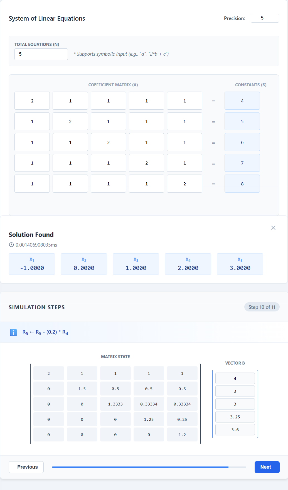
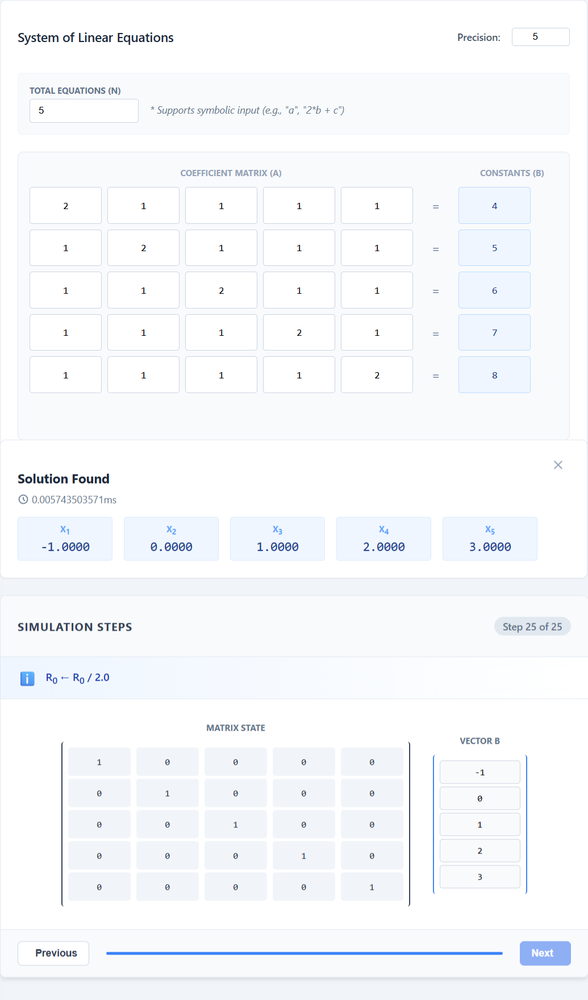
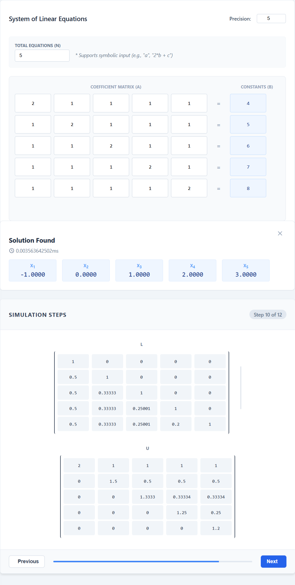
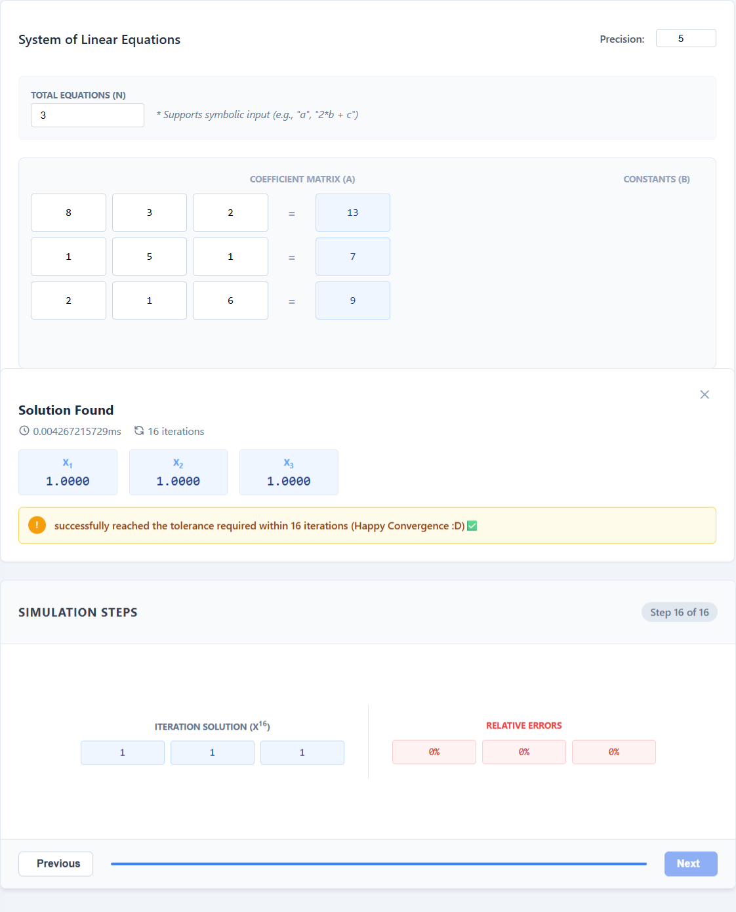

  <h1>🔢 Numerical Solver</h1>
  
<i>A comprehensive numerical computing tool for solving linear and non-linear systems.</i>

  <!-- Badges -->
  

    
    
    
    
  

> **Note**: This is a university assignment for Numerical Computing course at Alexandria University CSED.

## 🚀 What this project does

This project is a powerful numerical solver capable of solving both **Linear Systems of Equations** and finding the roots of **Non-Linear Equations**. It provides numerical estimations as well as exact symbolic evaluations for various well-known algorithms. Built with a Flask backend and an Angular frontend, it provides an intuitive web interface for plotting functions, interacting with mathematical matrices, and viewing step-by-step solutions.

## 📥 Dataset / Input Format

The tool accepts mathematical systems dynamically via the web interface. 
- **Linear Systems**: Defined by a square matrix $A$ (coefficients) and a column vector $b$ (constants). Inputs are provided via a grid UI and sent to the backend as JSON payloads (`A` array and `b` array).
- **Non-Linear Systems**: Defined by an equation $f(x) = 0$. The user provides the mathematical string function alongside required parameters like initial guesses ($x_0$, $x_1$) or brackets ($[x_l, x_u]$), desired precision, and tolerance.

## 📐 Design Choices

- **Design Patterns**: Heavy use of the **Factory Pattern** (`SolverFactory.py`) to decouple solver instantiation logic from the API endpoints. Different factories handle Numerical, Symbolic, and Non-Linear solvers seamlessly.
- **Symbolic & Numerical Evaluation**: Using `sympy` for exact fractional evaluation (symbolic mode) alongside standard `numpy` floating-point operations.
- **Client-Server Architecture**: Separating the heavy computational logic (Flask, Python) from the UI components (Angular, TypeScript).
- **Extensibility**: The object-oriented approach across linear and nonlinear methods ensures that new algorithms can be plugged in by inheriting from abstract base classes.

## 🧮 Algorithms & Approach

### Linear System Solvers
- **Gauss Elimination & Gauss Jordan**: Systematic row reduction to upper triangular or reduced row echelon form. Time complexity: $\mathcal{O}(n^3)$.
- **LU Decomposition**: Splitting matrix $A$ into lower ($L$) and upper ($U$) triangular matrices. Evaluates Doolittle ($L_{ii}=1$), Crout ($U_{ii}=1$), and Cholesky ($A=LL^T$, requires symmetric positive-definite). Decomposition complexity: $\mathcal{O}(n^3)$.
- **Iterative Methods (Gauss-Seidel & Jacobi)**: Successive approximations of $x$ using the recurrence $x^{(k+1)} = T x^{(k)} + C$. Time complexity: $\mathcal{O}(n^2)$ per iteration.

### Non-Linear Root Finding
- **Bracketing Methods**: 
  - **Bisection**: Repeatedly halves the interval. Time complexity: $\mathcal{O}(\log(\frac{b-a}{\epsilon}))$.
  - **False Position**: Uses similar triangles to interpolate the root.
- **Open Methods**:
  - **Fixed Point Iteration**: Rearranges $f(x)=0$ to $x=g(x)$.
  - **Original Newton Raphson**: Utilizes the derivative to find the tangent root: $x_{i+1} = x_i - \frac{f(x_i)}{f'(x_i)}$.
  - **Modified Newton Raphson**: Handles multiple roots using the second derivative: $x_{i+1} = x_i - \frac{f(x_i)f'(x_i)}{(f'(x_i))^2 - f(x_i)f''(x_i)}$.
  - **Secant Method**: Approximates the derivative using two initial guesses: $x_{i+1} = x_i - \frac{f(x_i)(x_{i-1} - x_i)}{f(x_{i-1}) - f(x_i)}$.

## 📁 Project Structure

- `BackEnd/` - Core computational implementations.
  - `linearMethods.py` - Classes for linear algebraic solvers.
  - `nonlinearMethods.py` - Classes for root-finding algorithms.
- `FrontEnd/Numerical-Solver/` - Angular codebase for the user interface.
- `app.py` - Flask API router connecting the frontend to the numerical models.
- `SolverFactory.py` - Factory pattern implementations to dynamically instantiate solvers.
- `Plotter.py` - Utility to evaluate function points for frontend plotting.
- `mainSymbols.py` - Logic for symbolic calculations using SymPy.

## ⚙️ How to Run

1. **Start the Backend**:
   - Install dependencies: `pip install -r requirements.txt`
   - Run the server: `python app.py`
   - The Flask API will run on `http://127.0.0.1:5000`.

2. **Start the Frontend**:
   - Navigate to `FrontEnd/Numerical-Solver/`.
   - Install dependencies: `npm install`
   - Run the Angular server: `ng serve`
   - Access the UI at `http://localhost:4200`.

## 📷 Screenshots

### Linear Methods

 
*The interface for Gauss Elimination, demonstrating step-by-step matrix row operations.*

  

 
*The Gauss-Jordan elimination visual output.*

  

 
*LU Decomposition using Doolittle's method showing the $L$ and $U$ matrices.*

  

 
*Jacobi iteration error tolerance and stopping criteria visualization.*

### Non-Linear Root Finding

 
*Bisection method bracketing the root successfully.*

  

 
*False Position method interpolating the root linearly between bounds.*

  

 
*Original Newton Raphson method rapid convergence using function derivatives.*

  

 
*Secant Method finding the root without requiring an analytical derivative.*

## ⚠️ Observations & Known Limitations

- **Cholesky Decomposition**: Strictly requires the input matrix $A$ to be symmetric and positive-definite. Providing an invalid matrix will result in a runtime exception.
- **Floating Point Inaccuracies**: Relying solely on `float64` precision during numerical operations might lead to minor truncation errors at extremely high depths of calculation. Symbolic mode is recommended when exact fractions are required.
- **Newton-Raphson Pitfalls**: Original and Modified Newton-Raphson methods might fail to converge if the initial guess $x_0$ falls on a point where the derivative is $0$ ($f'(x_0) = 0$).
- **Iterative Symbolic Limitation**: Symbolic mode is not currently implemented for iterative linear solvers (Gauss-Seidel, Jacobi), as the iterative approach fundamentally relies on floating-point approximations.

## Contributors
---

- [@tofyfathy12](https://github.com/tofyfathy12)
- [@AbdelrahmanMohamed911](https://github.com/AbdelrahmanMohamed911)
- [@Joo-Ashraf1](https://github.com/Joo-Ashraf1)
- [@AYousry12](https://github.com/AYousry12)
- [@MohamedEliwa204](https://github.com/MohamedEliwa204)
